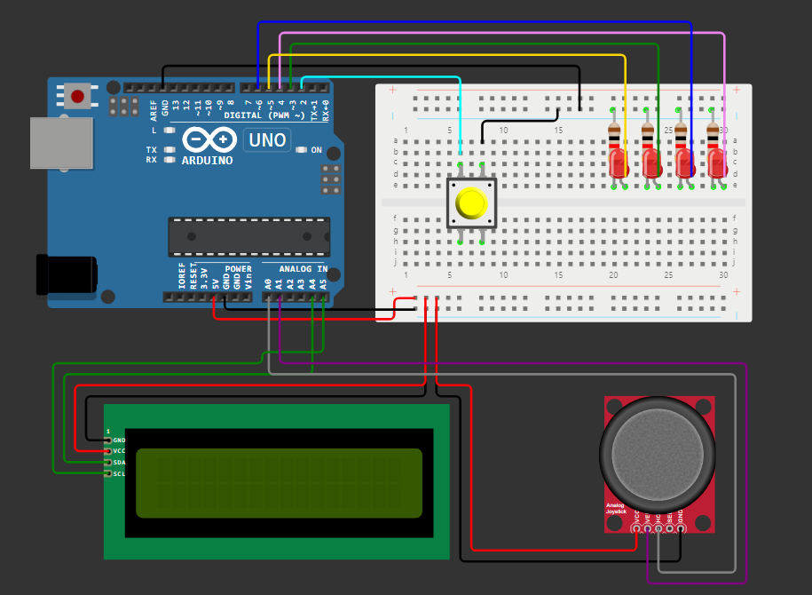

# Reaction Time Game with Arduino

A progressive difficulty reaction time game where an LED lights up, and the player must move the joystick as quickly as possible in the correct direction. The game features score-based difficulty scaling, persistent high score tracking, and displays reaction time and score on an LCD screen.

## Table of Contents
- [Project Overview](#project-overview)
- [Features](#features)
- [Hardware Requirements](#hardware-requirements)
- [Circuit Diagram](#circuit-diagram)
- [Installation](#installation)
- [Usage](#usage)
- [Difficulty System](#difficulty-system)
- [Scoring](#scoring)

## Project Overview
The reaction time game randomly lights up one of four LEDs, and the player must quickly move the joystick in the corresponding direction. The game records the player's reaction time and updates the score after each round, displayed on a 1602 I2C LCD screen. As the player's score increases, the game progressively becomes more challenging with time limits and faster LED patterns.

## Features
- Randomly lights up one of four LEDs in different directions
- Records and displays reaction time in milliseconds
- Progressive difficulty system that scales with player score
- Persistent high score storage using EEPROM (survives power cycles)
- Real-time score tracking and display on LCD
- Four difficulty levels: Easy, Medium, Hard, and Extreme
- Time-limited reactions in higher difficulties
- LED blinking challenges in Extreme mode
- Non-blocking game loop for smooth performance
- Debounced button and joystick input for reliable controls

## Hardware Requirements
Here are the components you will need:

| Component        | Quantity | Image                                      |
|------------------|----------|--------------------------------------------|
| Arduino Uno      | 1        |         |
| LED (any color)  | 4        |                         |
| 220Ω Resistor    | 4        |               |
| Joystick Module  | 1        |               |
| Button           | 1        |                   |
| I2C LCD (1602)   | 1        |                         |
| Breadboard       | 1        |           |
| Jumper Wires     | As needed|       |

## Circuit Diagram

Below is a brief description of how to wire the components:
- **LEDs**: Connect each LED to a digital pin on the Arduino (pins 3, 4, 5, 6). Use a 220Ω resistor in series with each LED.
  - Pin 3: Up direction LED
  - Pin 4: Down direction LED
  - Pin 5: Left direction LED
  - Pin 6: Right direction LED
- **Joystick Module**: Connect X-axis to A0 and Y-axis to A1. GND goes to GND, and VCC goes to 5V.
- **Button**: Connect to pin 2 with internal pull-up resistor enabled.
- **LCD I2C**: Connect SDA to A4, SCL to A5. VCC to 5V, and GND to GND.

### Wiring Diagram

## Installation

### 1. Install the required libraries
- Open Arduino IDE and go to **Sketch > Include Library > Manage Libraries...**
- Search for and install the following libraries:
  - `LiquidCrystal_I2C` - for the I2C LCD display
  - `Wire` - for I2C communication (usually included by default)
  - `EEPROM` - for persistent storage (included by default)

### 2. Upload the code
- Open the provided `.ino` file in the Arduino IDE.
- Under **Tools > Board**, select **Arduino Uno**.
- Under **Tools > Port**, select the correct port for your Arduino.
- Click the upload button to upload the code to your Arduino.

## Usage

### Start the game:
- Once powered on, the LCD will display "Reaction Game!" and show your current high score.
- Press the start button to begin the game.
- The LCD will display "Get Ready!" along with the current difficulty mode.

### Gameplay:
- An LED will light up in one of four directions (up, down, left, or right).
- Quickly move the joystick in the corresponding direction as soon as the LED lights up.
- The game will display your reaction time in milliseconds and your current score.
- After a brief pause, the next round begins automatically.

### Difficulty progression:
- The game starts in Easy mode (no time limit).
- As your score increases, the difficulty automatically scales up.
- Higher difficulties introduce time limits and faster LED patterns.

### Score and reaction time:
- Faster reactions earn more points:
  - 0-100ms: 10 points
  - 101-250ms: 5 points
  - 251-500ms: 3 points
  - 501-1000ms: 2 points
  - Over 1000ms: 1 point
- Your score is displayed after each successful round.
- A "NEW!" indicator appears when you beat your high score during gameplay.

### Game over:
- The game ends if you move the joystick in the wrong direction or exceed the time limit (in higher difficulties).
- The LCD will display "Game Over!" or "NEW HIGH SCORE!" along with your final score.
- Your high score is automatically saved to EEPROM if you set a new record.

### Restart the game:
- After the game ends, the LCD will prompt "Start Over?"
- Press the button to restart and try to beat your high score.

## Difficulty System

The game features four difficulty levels that automatically activate based on your score:

### Easy Mode (Score 0-19)
- No time limit to react
- LED stays on until you respond
- Perfect for learning the game mechanics
- "Get Ready" delay: 1.5 seconds

### Medium Mode (Score 20-49)
- 3 second time limit to react
- LED stays visible for 3 seconds
- Game over if no response within time limit
- "Get Ready" delay: progressively decreases

### Hard Mode (Score 50-99)
- 2 second time limit (reduces to 1.5s at score 100+)
- LED only shows for 1 second
- Must remember which LED was lit
- Faster pacing between rounds

### Extreme Mode (Score 100+)
- 1.5 second time limit to react
- LED blinks rapidly (every 250ms) for only 0.5 seconds
- Tests both memory and reaction speed
- Maximum challenge with minimal "Get Ready" delay (300ms)

## Scoring

Points are awarded based on reaction speed:
- **10 points**: Lightning fast (0-100ms)
- **5 points**: Very fast (101-250ms)
- **3 points**: Fast (251-500ms)
- **2 points**: Good (501-1000ms)
- **1 point**: Acceptable (over 1000ms)

Your high score is permanently saved in the Arduino's EEPROM memory and persists even when the device is powered off. Challenge yourself to reach higher scores and unlock the more difficult game modes!