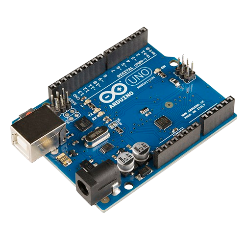
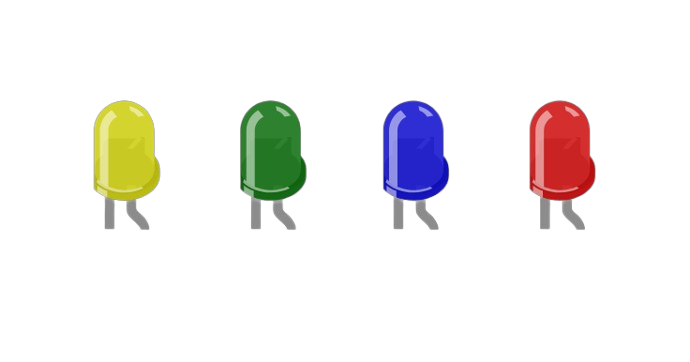
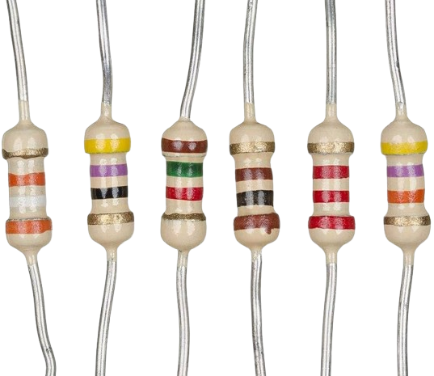
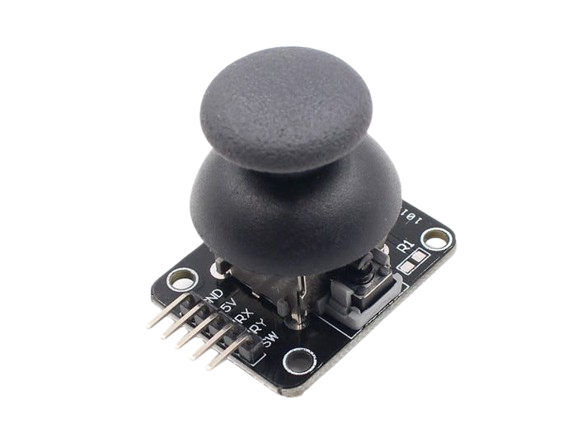
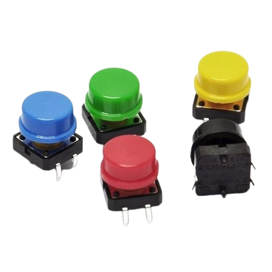
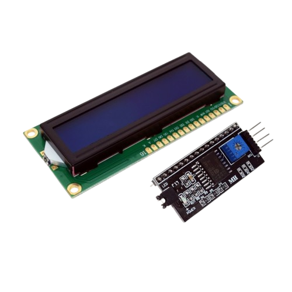
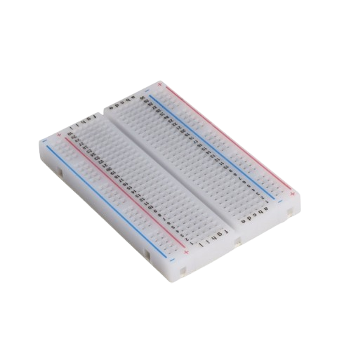
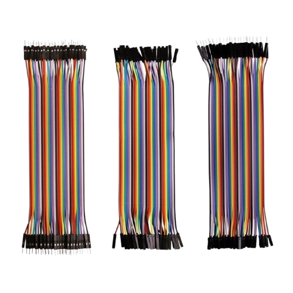

# Reaction Time Game with Arduino

A reaction time game where an LED lights up, and the player must move the joystick as quickly as possible in the correct direction. The player's reaction time and score are displayed on an LCD screen.

## Table of Contents
- [Project Overview](#project-overview)
- [Features](#features)
- [Hardware Requirements](#hardware-requirements)
- [Circuit Diagram](#circuit-diagram)
- [Installation](#installation)
- [Usage](#usage)
- [Code](#code)
- [Contributing](#contributing)
- [License](#license)

## Project Overview
The reaction time game randomly lights up an LED, and the player must quickly move the joystick in the corresponding direction. The game records the player's reaction time and updates the score after each round, displayed on a 1602 I2C LCD screen.

## Features
- Randomly lights up one of four LEDs.
- Records and displays reaction time in milliseconds.
- Keeps track of the player's score and displays it on an LCD.
- Easy to reset and replay the game.

## Hardware Requirements
Here are the components you will need:

| Component        | Quantity | Image                                      |
|------------------|----------|--------------------------------------------|
| Arduino Uno      | 1        |         |
| LED (any color)  | 4        |                         |
| 220Ω Resistor    | 4        |               |
| Joystick Module  | 1        |               |
| Button           | 1        |                   |
| I2C LCD (1602)   | 1        |                         |
| Breadboard       | 1        |           |
| Jumper Wires     | As needed|       |

## Circuit Diagram
Below is a brief description of how to wire the components:
- **LEDs**: Connect each LED to a digital pin on the Arduino (pins 3, 4, 5, 6). Use a 220Ω resistor in series with each LED.
- **Joystick Module**: Connect X and Y pins to analog pins A0 and A1. GND goes to GND, and VCC goes to 5V.
- **Button**: The button pin is connected to pin 2.
- **LCD I2C**: Connect SDA to A4, SCL to A5. VCC to 5V, and GND to GND.
